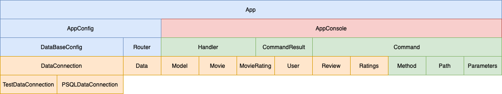

# Relatório técnico da Fase 1

## Introdução

Este documento contém os aspectos relevantes do desenho e implementação da fase 1 do projecto de LS.

## Modelação da base de dados

### Modelação conceptual ###

O seguinte diagrama apresenta a modelo entidade-associação para a informação gerida pelo sistema. 

(_include an image or a link to the conceptual diagram_)

Destacam-se os seguintes aspectos deste modelo:

* (_include a list of relevant design issues_)

O modelo conceptual apresenta ainda as seguintes restrições:

* (_include a list of relevant design issues_)
    
### Modelação física ###

O modelo físico da base de dados está presente em (_link to the SQL script with the schema definition_).

Destacam-se os seguintes aspectos deste modelo:

* (_include a list of relevant design issues_)

## Organização do software

A aplicação está dividida em várias camadas, de modo a permitir uma melhor 
gestão dos componentes e uma separação das responsabilidades de cada camada.

O desenvolvimento da aplicação aproxima-se da utilização do _design_ MVC, onde
temos o componente _Model_, compreendendo a configuração e inicialização da 
ligação á base de dados Postgresql, bem como introdução de classes representando
o _domain_.

A componente do _Controller_, que está refletida na existência do _Router_ e dos
diversos _Handlers_ que fazem a ponte entre o _input_ do utilizador, na forma de 
um comando, e o _output_ que vêm da base de dados.

Por fim, procurou-se criar a _View_ da aplicação numa classe que tem toda a 
interação com a consola, e que permite rapidamente mudar para outra _view_ (_Web_)
devido ao seu encapsulamento. 

### Processamento de comandos

O processamento dos _inputs_ do utilizador está distribuído, entre a passagem
como argumento para a aplicação ou através de um modo interativo disponível
na `AppConsole`, que solicita _inputs_ até ao comando para sair - `EXIT /`.

Na `AppConsole` é realizada a conversão do _input_ do utilizador na estrutura 
de dados representada pela classe `Command`, que agrega:
*  `enum Method`: representa o pedido, aceitando os valores GET/POST/PUT
*  `class Path`: guarda uma lista com os componentes do caminho
*  `class Parameters`: guarda uma lista com os parâmetros

A classe `Command` tem definida o método `matches(Command)` que lhe permite ser usada
para definir um _template_ para cada comando aceite pela a aplicação e validar
de forma transparente o comando introduzido pelo utilizador. 

Essa validação é replicada com a utilização de métodos similares nos objetos
que compõem a classe `Command`, sendo:
*  método `equals(Object)`: no `Method` porque queremos que seja igual
*  método `matches(Object)`: na `Path` e `Parameters`, porque queremos que siga a
estrutura do _template_.

O local de validação ocorre no `Router`, no momento em que se pretende obter o 
_handler_ responsável pelo comando. Caso seja um comando inválido, o `Router`
lança uma exceção `RouterException` com a informação do comando inválido.

### Encaminhamento dos comandos

O processo de execução dos comandos é feito através da conjunção de dois 
componentes da aplicação:
- `Router`: lista os _handlers_ da aplicação que executam os comandos
- `Handlers`: responsáveis pela leitura e execução dos comandos

#### _Routing_ 

No processo de início da aplicação é feita a configuração de um objeto `Router`
que é preenchido com todos os _handlers_ disponíveis pela aplicação.

O preenchimento é feito através do método `addHandler(Method, Path, Handler)`
que recebe a indicação do método, caminho e uma nova instância do handler que 
trata desta configuração de comando.

Nota: que os parâmetros (objecto `Parameter`) está definido no _handler_.

A utilização do método, permite definir numa lista todos os _handlers_ disponíveis
na aplicação e que podem ser utilizados. A forma de utilizar é através do outro
método disponível `findHandler(Command)`.

No método `findHandler` é feita a comparação do comando do utilizador com o 
`template` e dessa forma retornar a instância de _handler_ para tratar e executar
o comando.

#### _Handlers_

Os _handlers_ são responsáveis por tratar e executar os comandos do utilizador.

Foi definido um contrato que indica que todos os _handlers_ têm o método com a
assinatura `public CommandResult execute(Command)` que é responsável por executar
o comando. Este contrato é definido com recurso à _interface_ `IHandler`.

Para servir de base aos _handlers_ é definida a classe abstrata `Handler`
que define o _template_, bem como o construtor-base dos _handlers_.

Depois é feito o _handler_ para cada comando aceite pela aplicação que extende 
a classe base `Handler` e implementa o interface `IHandler`.
Cada _handler_ tem a definição dos parâmetros que aceita e necessita de receber
para executar o pedido. No processo de validação dos parâmetros recebidos...

Nesta fase, o _handler_ tem o código que trata do acesso á base de dados, que em 
fase seguinte, será feito um _refactoring_ e movido esse código para a camada 
aplicacional correta, relacionada com o acesso e tratamento de acesso á BD.

##### Retorno dos resultados

Os _handlers_ retornam os resultados da execução do comando através de uma 
instância da classe `CommandResult` que é constituída por um conjunto de 
informação que representa:
*  Estado: 0 - sem resultados, > 0 - número afetações de resultados
*  Lista modelos: representa o resultado dos modelos do domain que agregam a 
informação-alvo da interação com a base de dados.

### Acesso a dados

A aplicação tem prevista uma camada aplicacional para tratar dos dados e as 
interações com a BD, pelo que se desenvolveu a seguinte lógica:
*  `DataBaseConfig` - Carrega de variáveis ambiente e prepara a configuração da
ligação, inclusive a iniciação da `Data` que guarda a conexão á BD através da
`DataConnection`
*  `DataConnection` - Responsável por estabelecer a ligação e manter a conexão á BD
*  `Data` - Classe que torna transparente a ligação á BD, permitindo ao utilizador
obter a conexão á BD quando necessário para fazer as queries _necessárias_.

Estas 3 classes permitem estabelecer a ligação á base de dados sempre que 
necessário ser executado um comando. Para assegurar a atomicidade das transações,
optou-se por na classe `DataConnection` definir á partida que o _auto commit_ 
está desabilitado, sendo necessário em todas as transações fazer o _commit_ ou 
_rollback_. Essa tarefa acrescenta um custo em definir mais uma linha de código,
que seria desnecessária, na operação de _select_ mas sendo que pode ser necessário
fazer várias operações de _select_ numa transação, garantimos que não existiu
uma alteração que invalida os dados entre selects e/ou outras operações.

A definição deste modo para utilização da BD permite a evolução para a definição
da camada de dados de forma completamente separada da lógica de negócio definida
nos _handlers_ para tratar os comandos.

A evolução pode passar pela alteração da classe `Data` para a transformar numa classe 
abstrata que depois serve para definir as várias classes que realizam as operações
de interação com a BD, conforme o _handler_. Ou pode ser a criação de outras 
classes do estilo da _DataConnection_ que possam ser utilizadas para interagir 
com base de dados diferentes da atual ou, mesmo através da ligação a uma API externa.

### Acesso a dados

(_identify any non-trivial used SQL statements_).

### Processamento de erros

(_describe how errors are handled and communicated to the application user_).

## Avaliação crítica

(_enumerate the functionality that is not concluded and the identified defects_)

(_identify improvements to be made on the next phase_)

Nesta fase, os _handlers_ têm a lógica de acesso á base de dados, o que nos 
parece ser uma quebra no isolamento que pretendemos alcançar na aplicação.
Na fase seguinte pretendemos desenvolver a camada de acesso a dados (_Model_) 
criando as classes de mapeamento ou _data access objects_ para ser elas a fazerem
a interação com o modelo de dados e tornando transparente para o _handler_ como 
é feito o processamento dos dados, ficando só responsável por reunir a informação
necessária e dar a ordem de execução, bem como retornar os dados tratados.